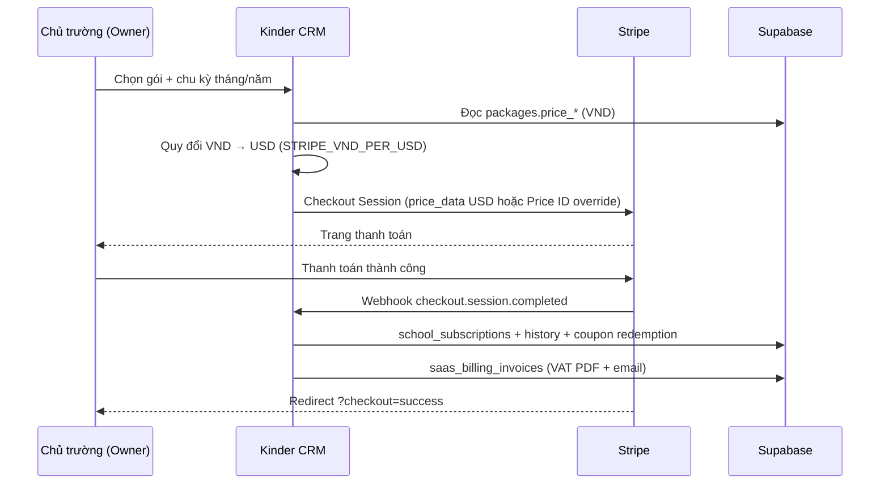

# Hướng dẫn tích hợp Stripe (SaaS billing)

Tài liệu mô tả cách cấu hình thanh toán gói **Starter** và **Pro** qua Stripe Checkout cho Kinder CRM.

**Nguyên tắc giá:** giá **hiển thị** lấy từ `packages` (`price_monthly`, `price_yearly`) bằng **VND**. Stripe **không hỗ trợ VND** — khi checkout app quy đổi sang **USD** theo `STRIPE_VND_PER_USD`. Không dùng biến env `STRIPE_PRICE_*`.

---

## Tổng quan

### Catalog gói

Hệ thống cố định **3 gói** (`free`, `starter`, `pro`). Chỉ **Starter** và **Pro** có thanh toán Stripe.

| Gói | Checkout | `price_monthly` | `price_yearly` |
|-----|----------|-----------------|----------------|
| Free | Không | 0 | — |
| Starter | Có | 990.000 ₫ | 9.900.000 ₫ |
| Pro | Có | 2.490.000 ₫ | 24.900.000 ₫ |

Giá trên là giá mặc định sau migration; có thể chỉnh tại **Platform → Gói** mà không cần redeploy.

### Luồng thanh toán



### Thành phần chính

| Thành phần | Vai trò |
|---|---|
| `createSubscriptionCheckoutAction` | Owner tạo phiên Checkout, redirect sang Stripe |
| `POST /api/billing/stripe/webhook` | Nhận sự kiện Stripe, đồng bộ DB (idempotent) |
| `createBillingPortalAction` | Mở Stripe Customer Portal (đổi thẻ, hóa đơn, hủy gói) |
| `buildCheckoutLineItem` | Tạo line item USD từ giá VND DB hoặc override Price ID |
| `vnd-usd-exchange.ts` | Quy đổi VND ↔ USD cents |
| `changePackageAction` | Chỉ dùng khi Stripe **chưa** bật (dev/staging) |

Khi `STRIPE_SECRET_KEY` **không** được set, ứng dụng hoạt động như trước: đổi gói trực tiếp qua `changePackageAction` (phù hợp dev/staging không cần thanh toán).

---

## Cách app tính giá checkout

Logic nằm trong `stripe-package-pricing.ts` và `vnd-usd-exchange.ts`.

### Hiển thị cho user: VND

- UI (Gói đăng ký, marketing, Platform) luôn hiển thị `price_monthly` / `price_yearly` bằng **VND**.
- Dưới mỗi gói trả phí có ghi chú **Thanh toán Stripe: ~$X.XX** (ước tính USD).

### Thanh toán Stripe: USD

1. Owner chọn gói và chu kỳ (**tháng** / **năm**).
2. App đọc giá VND từ `packages`.
3. Quy đổi: `usd_cents = round((vnd / STRIPE_VND_PER_USD) * 100)` (tối thiểu 50¢).
4. Tạo Checkout với `price_data`:
   - `currency`: `usd`
   - `unit_amount`: số **cent** USD
   - `recurring.interval`: `month` hoặc `year`
   - `product_data.metadata`: `price_vnd`, `vnd_per_usd`, `package_id`, …

**Ví dụ** (`STRIPE_VND_PER_USD=25000`):

| Gói | VND/tháng | USD checkout |
|-----|-----------|--------------|
| Starter | 990.000 | ~$39.60 |
| Pro | 2.490.000 | ~$99.60 |

**Không cần** tạo Product/Price trước trên Stripe Dashboard (trừ khi override).

### Tỷ giá: `STRIPE_VND_PER_USD`

| Biến | Ý nghĩa | Mặc định |
|------|---------|----------|
| `STRIPE_VND_PER_USD` | Số VND cho **1 USD** | `25000` |

Tỷ giá được lưu trong metadata Checkout để hóa đơn SaaS quy đổi ngược USD → VND.

### Override tuỳ chọn: Stripe Price ID

Nếu gói đã có Price **USD** cố định trên Stripe, nhập vào Platform:

| Cột DB | Dùng khi |
|--------|----------|
| `stripe_price_id` | Checkout chu kỳ **tháng** |
| `stripe_price_yearly_id` | Checkout chu kỳ **năm** |

Khi override được set, Checkout dùng `price: price_…` (USD) thay vì `price_data`. Webhook vẫn map gói qua cột này hoặc metadata `package_id`.

### Điều kiện hiển thị checkout

- Gói thuộc catalog cố định (`starter`, `pro`) và `price_monthly > 0`.
- Chu kỳ **năm** chỉ hiện khi `price_yearly > 0` (hoặc có `stripe_price_yearly_id`).
- Chỉ **owner** (`school_members.role = owner`) được thanh toán.

### Metadata gắn trên Checkout

```
school_id, package_id, user_id, billing_interval
price_vnd, vnd_per_usd, usd_cents
(+ coupon_id, coupon_code nếu có mã giảm giá)
```

Metadata được copy sang `subscription_data.metadata` trên Stripe Subscription.

---

## 1. Chuẩn bị Stripe Dashboard

### 1.1 Tiền tệ Stripe: USD

Stripe account cần hỗ trợ **USD**. Giá trong DB (`packages`) vẫn là **VND** — app tự quy đổi khi tạo Checkout.

Cấu hình tỷ giá trong env:

```env
STRIPE_VND_PER_USD=25000
```

### 1.2 Giá trên Stripe (tuỳ chọn)

**Mặc định không cần** tạo Product/Price. Chỉ tạo trên Dashboard nếu muốn override bằng Price ID cố định (xem mục trên).

Chỉnh giá thực tế tại **Platform → Gói** → **Price monthly (VND)** / **Price yearly (VND)**.

### 1.3 Customer Portal

1. **Settings** → **Billing** → **Customer portal**.
2. Bật portal, cho phép khách hủy subscription / cập nhật phương thức thanh toán.
3. Lưu cấu hình.

### 1.4 Webhook endpoint (production)

1. **Developers** → **Webhooks** → **Add endpoint**.
2. **Endpoint URL:**
   ```
   https://<domain-của-bạn>/api/billing/stripe/webhook
   ```
3. Chọn các event:
   - `checkout.session.completed`
   - `customer.subscription.updated`
   - `customer.subscription.deleted`
   - `invoice.payment_succeeded`
   - `invoice.payment_failed`
4. Copy **Signing secret** (`whsec_…`) → `STRIPE_WEBHOOK_SECRET`.

---

## 2. Migration database

Chạy migration trên Supabase (local hoặc production):

```bash
cd apps/web
pnpm supabase db push
```

Các migration liên quan billing:

| Migration | Nội dung |
|-----------|----------|
| `20260747000000_kinder_packages_seed.sql` | Seed gói free / starter / pro |
| `20260748000000_kinder_stripe_billing.sql` | `stripe_price_id`, `stripe_customer_id`, `stripe_webhook_events` |
| `20260753000000_kinder_subscription_past_due.sql` | Grace period `past_due` |
| `20260755000000_kinder_subscription_history_stripe_invoice.sql` | Lịch sử gói + Stripe invoice ref |
| `20260756000000_kinder_saas_billing_invoices.sql` | Hóa đơn VAT SaaS |
| `20260758000000_kinder_subscription_coupons.sql` | Mã giảm giá subscription |
| `20260759000000_kinder_annual_billing.sql` | `price_yearly`, `stripe_price_yearly_id` |
| `20260760000000_kinder_fixed_three_packages.sql` | Catalog cố định 3 gói |
| `20260761000000_kinder_rebalance_package_tiers.sql` | Quota Starter/Pro |

---

## 3. Biến môi trường

Thêm vào `.env.local` (dev) hoặc hosting production (xem `apps/web/.env.example`):

### Bắt buộc (khi bật Stripe)

| Biến | Mô tả |
|---|---|
| `STRIPE_SECRET_KEY` | Secret key `sk_test_…` hoặc `sk_live_…` |
| `STRIPE_WEBHOOK_SECRET` | Signing secret `whsec_…` từ webhook endpoint hoặc Stripe CLI |
| `STRIPE_VND_PER_USD` | Tỷ giá: số VND cho 1 USD (mặc định `25000`) |
| `NEXT_PUBLIC_SITE_URL` | URL gốc app (redirect sau Checkout / Portal) |

### Tuỳ chọn

| Biến | Mặc định | Mô tả |
|---|---|---|
| `SUBSCRIPTION_PAST_DUE_GRACE_DAYS` | `7` | Ngày grace trước khi `past_due` → chỉ đọc + giới hạn Free |
| `SAAS_VAT_RATE` | `10` | Thuế VAT trên hóa đơn SaaS (%) |
| `SAAS_INVOICE_SELLER_*` | — | Thông tin người bán trên PDF hóa đơn |
| `SMTP_*` | — | Gửi email hóa đơn PDF và nhắc trial |

### Không còn dùng

Các biến sau **đã bỏ** — xóa khỏi `.env` nếu còn:

```
STRIPE_PRICE_STARTER
STRIPE_PRICE_PRO
STRIPE_PRICE_*_YEARLY
```

---

## 4. Cấu hình giá trên Platform

1. Đăng nhập **Platform admin** → **Gói**.
2. Sửa **Starter** / **Pro**:
   - **Price monthly (VND)** — giá checkout tháng
   - **Price yearly (VND)** — giá checkout năm (`0` = ẩn tuỳ chọn năm)
3. *(Tuỳ chọn)* **Stripe Price ID** tháng/năm — override Price có sẵn trên Stripe.
4. Lưu — checkout dùng giá mới ngay, **không cần redeploy**.

Ví dụ đổi Starter lên 1.190.000 ₫/tháng: chỉ sửa `price_monthly` trên Platform.

---

## 5. Chu kỳ thanh toán (tháng / năm)

- UI có toggle **Tháng / Năm** khi ít nhất một gói trả phí có `price_yearly > 0`.
- Checkout gửi `billing_interval` trong metadata.
- Giá năm mặc định = 10 tháng (tương đương giảm 2 tháng) sau migration `20260759000000`.

---

## 6. Mã giảm giá (coupons)

Quản lý tại **Platform → Mã giảm giá**.

| Loại | Hành vi checkout |
|------|------------------|
| `percent_off` | Đồng bộ sang Stripe Promotion Code; áp dụng qua `discounts` |
| `free_months` | Trial `trial_period_days = số_tháng × 30` |

- Owner nhập mã trên trang Gói đăng ký trước khi thanh toán.
- Webhook `checkout.session.completed` ghi `subscription_coupon_redemptions`.
- Khi dùng mã nội bộ, `allow_promotion_codes` tắt (không trùng với mã Stripe Dashboard).

---

## 7. Phát triển local với Stripe CLI

### 7.1 Cài Stripe CLI

```bash
brew install stripe/stripe-cli/stripe
stripe login
```

### 7.2 Chạy webhook forward

Terminal 1 — app:

```bash
pnpm dev
```

Terminal 2 — forward webhook:

```bash
cd apps/web
pnpm stripe:listen
```

CLI in ra `whsec_…` — dán vào `STRIPE_WEBHOOK_SECRET` trong `.env.local`, restart dev server.

> Dùng secret từ `stripe listen`, **không** dùng secret webhook production trên local.

### 7.3 Test Checkout

1. Tạo trường mới (onboarding) hoặc dùng trường có sẵn.
2. Đăng nhập bằng tài khoản **owner**.
3. Vào **Cài đặt** → **Gói đăng ký**.
4. Chọn chu kỳ **Tháng** hoặc **Năm** (nếu có).
5. Chọn **Starter** hoặc **Pro** → **Thanh toán & đăng ký**.
6. *(Tuỳ chọn)* Nhập mã giảm giá.
7. Dùng thẻ test: `4242 4242 4242 4242`, expiry tương lai, CVC bất kỳ.

Sau thanh toán:

- Redirect về `…/settings/subscription?checkout=success`
- Webhook cập nhật `school_subscriptions` (`package_id`, `status`, `stripe_*`)
- Ghi `school_subscription_history`
- Phát hành `saas_billing_invoices` (nếu SMTP đã cấu hình)

Thẻ test khác: [Stripe testing](https://docs.stripe.com/testing).

---

## 8. Kiểm tra sau deploy production

| Bước | Kỳ vọng |
|---|---|
| Owner mở trang Gói đăng ký | Nút **Thanh toán & đăng ký** cho Starter/Pro |
| Toggle tháng/năm | Hiện khi gói có `price_yearly > 0` |
| Sau khi đã thanh toán | Nút **Quản lý thanh toán** (Customer Portal) |
| Trạng thái `past_due` | Banner + **Cập nhật thanh toán** → portal đổi thẻ |
| Stripe Dashboard → Webhooks | Event `200 OK` |
| Supabase `school_subscriptions` | `stripe_customer_id`, `stripe_subscription_id`, `package_id` đúng |
| Hủy subscription trên Portal | Webhook `deleted` → downgrade về **free** |
| Thanh toán thất bại | `invoice.payment_failed` → `past_due`, banner cảnh báo |
| Gia hạn thành công | `invoice.payment_succeeded` → hóa đơn VAT SaaS + email PDF |

---

## 9. Hóa đơn VAT SaaS

Sau mỗi lần thanh toán thành công (`checkout.session.completed` hoặc `invoice.payment_succeeded`):

1. Tạo bản ghi `saas_billing_invoices` (số `KC-SaaS-YYYY-NNNNNN`)
2. Tính VAT (`SAAS_VAT_RATE`, mặc định 10%)
3. Gửi email owner kèm PDF (cần `SMTP_*`)
4. Owner tải lại tại **Cài đặt → Gói đăng ký → Lịch sử**

```env
SAAS_VAT_RATE=10
SAAS_INVOICE_SELLER_NAME=Kinder CRM
SAAS_INVOICE_SELLER_TAX_CODE=
SAAS_INVOICE_SELLER_ADDRESS=
SAAS_INVOICE_SELLER_EMAIL=
```

> Hóa đơn SaaS **tách biệt** với module học phí (`public.invoices`).

---

## 10. Xử lý sự cố

### Redirect Checkout về localhost trên production

Kiểm tra `NEXT_PUBLIC_SITE_URL` trên hosting = domain production (không phải `http://localhost:3000`).

### Webhook trả 400 Invalid signature

- `STRIPE_WEBHOOK_SECRET` sai hoặc secret của endpoint khác (test vs live).
- Local: secret từ `pnpm stripe:listen`, không phải Dashboard production.

### Không checkout được / "price is not configured"

- **Platform → Gói**: `price_monthly > 0` (tháng) hoặc `price_yearly > 0` (năm).
- Nếu dùng override: `stripe_price_id` / `stripe_price_yearly_id` phải hợp lệ (`price_…`).
- Gói phải là `starter` hoặc `pro` (catalog cố định).

### Thanh toán xong nhưng gói chưa đổi

1. Stripe Dashboard → Webhooks → xem log event.
2. Server logs: `[stripe.webhook]`.
3. Xác nhận metadata `school_id`, `package_id` trên subscription.
4. Event failed → Stripe retry; hoặc **Sửa gói** từ Platform rồi đồng bộ lại từ Portal.

### Owner không thấy nút thanh toán

- Chỉ **owner** được quản lý billing.
- `STRIPE_SECRET_KEY` phải có trên server.
- Gói `price_monthly > 0`, code `starter` hoặc `pro`.

### Số tiền Stripe khác giá VND hiển thị

- Đây là hành vi mong đợi: UI hiển thị VND, Stripe charge USD theo `STRIPE_VND_PER_USD`.
- Cập nhật tỷ giá trên hosting và redeploy — chỉ áp dụng cho checkout **mới**.
- Subscription đang active giữ mức USD cũ cho đến khi đổi gói / tạo subscription mới.

### Đổi giá nhưng Stripe vẫn charge cũ

- Subscription **đang active** giữ giá cũ cho đến khi đổi gói / tạo subscription mới.
- `price_data` chỉ áp dụng lúc **tạo** Checkout Session mới.
- Muốn giá cố định lâu dài: tạo Price trên Stripe và set override trên Platform.

---

## 11. Tham chiếu mã nguồn

| File | Mô tả |
|---|---|
| `apps/web/lib/kinder/billing/vnd-usd-exchange.ts` | Quy đổi VND ↔ USD cents |
| `apps/web/lib/kinder/billing/stripe-vnd-exchange.server.ts` | Đọc `STRIPE_VND_PER_USD` |
| `apps/web/lib/kinder/billing/stripe-package-pricing.ts` | `price_data` USD từ giá VND DB |
| `apps/web/lib/kinder/billing/stripe-config.ts` | Bật Stripe, kiểm tra giá checkout |
| `apps/web/lib/kinder/billing/stripe-billing-shared.ts` | Gói trả phí (`starter`/`pro`) |
| `apps/web/lib/kinder/subscription/checkout-actions.ts` | Checkout + Customer Portal |
| `apps/web/lib/kinder/subscription/stripe-coupon-sync.ts` | Mã giảm giá → Stripe |
| `apps/web/app/api/billing/stripe/webhook/route.ts` | Webhook handler |
| `apps/web/lib/kinder/billing/stripe-subscription-sync.ts` | Đồng bộ subscription → DB |
| `apps/web/lib/kinder/subscription/issue-saas-invoice.ts` | Hóa đơn VAT SaaS + email |
| `apps/web/app/app/(workspace)/settings/subscription/` | UI gói đăng ký |
| `apps/web/app/platform/packages/` | Platform quản lý giá gói |

Roadmap: [subscription-roadmap.md](./subscription-roadmap.md) · Deploy: [PRODUCTION.md](./PRODUCTION.md).
